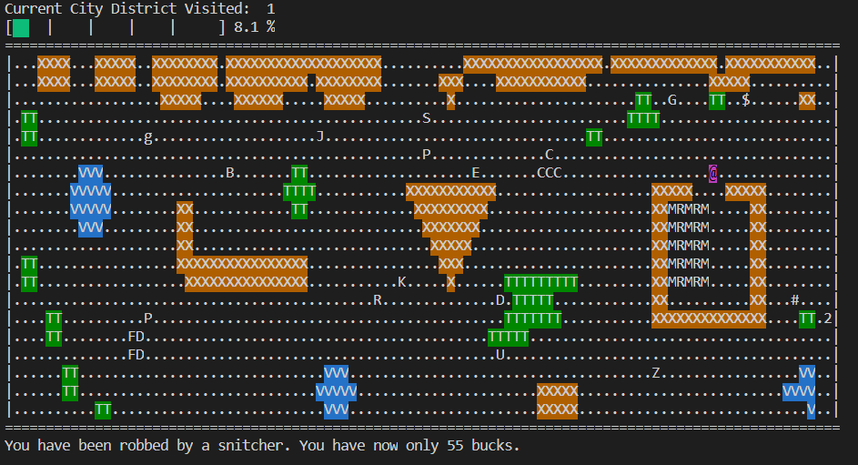
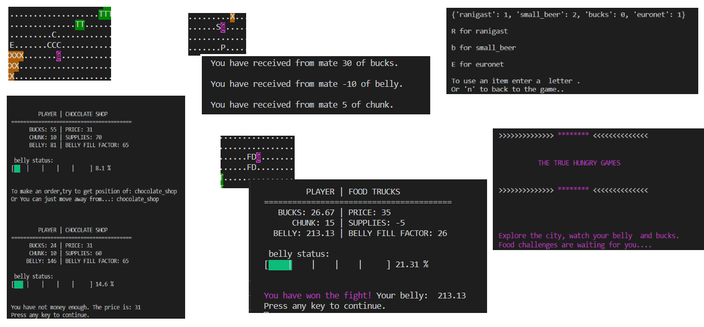

# Roguelike game

_Project developed in August 2020, second level in progress. (Codecool course)_ 

## Project assumptions

- Player explore boards, meets firends and enemies, finds different items
- Enemies move in various directions, they can attack first
- During fight the current status of health and other factors is displayed
- Hero has an inventory
- To go to another board a special key is necessary
- The WASD keys move the player up, left, down, and right on the screen, respectively
 
